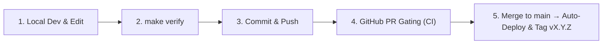

# Contributor & Agent Engineering Guide

Welcome to the **`mrxsierra.github.io`** repository. This document provides a concise, developer-first reference on repository architecture, local setup, development workflows, quality gates, and SDLC practices for human developers and autonomous AI coding agents.

---

## 1. Repository Layout

```text
├── docs/                      # Site markdown sources, assets, styles, & scripts
│   ├── assets/                # Static assets (images, icons, favicons)
│   ├── blog/                  # Blog post articles and index
│   ├── javascripts/           # Client-side custom scripts (index.js)
│   ├── projects/              # Featured project case studies & specs
│   ├── stylesheets/           # Custom CSS stylesheets (index.css, extra.css)
│   ├── index.md               # Portfolio homepage
│   ├── llms.txt               # High-level AI discovery index (auto-generated)
│   └── llms-full.txt          # Concatenated AI knowledge base (auto-generated)
├── hooks/                     # MkDocs lifecycle hooks
│   └── generate_ai_docs.py    # Auto-generates llms.txt and llms-full.txt pre-build
├── scripts/                   # Developer automation & verification tooling
│   ├── verify.py              # 5-stage pre-commit verification pipeline
│   └── install_hooks.py       # Git pre-commit hook installer
├── tests/                     # Automated pytest verification test suite
│   ├── test_smoke.py          # Core HTML pages, sitemaps, & static asset tests
│   ├── test_html_integrity.py # Link checker, DOM semantics, & template leak checks
│   └── test_hooks.py          # Build hook unit tests & llms.txt format checks
├── .github/workflows/
│   └── ci.yml                 # Multi-stage CI/CD pipeline (Lint, Types, Build, Test, Deploy)
├── .githooks/
│   └── pre-commit             # Git pre-commit hook runner
├── Makefile                   # Standard developer shortcuts
├── mkdocs.yml                 # Main MkDocs Material configuration
└── pyproject.toml             # Python dependencies, Ruff, Mypy, and Pytest configs
```

---

## 2. Quickstart & Local Environment

### Prerequisites
- Python 3.12+
- Git

### Setup
```bash
# 1. Create and activate virtual environment
python -m venv .venv
source .venv/bin/activate

# 2. Install all core & dev dependencies
pip install -r requirements.txt
pip install beautifulsoup4 mypy pytest ruff types-PyYAML types-beautifulsoup4 types-requests

# 3. (Optional) Install automatic git pre-commit hook
make hook-install
# or: git config core.hooksPath .githooks
```

---

## 3. Daily Development Workflows

### Live Preview Server
```bash
make serve
# Starts dev server with live reload at http://127.0.0.1:8000
```

### Adding / Editing Content
1. **Homepage (`docs/index.md`)**: Custom grid layout and hero banner.
2. **Projects (`docs/projects/<name>.md`)**: Include in `mkdocs.yml` navigation under `Projects`.
3. **Blog Posts (`docs/blog/posts/<name>.md`)**:
   - Provide standard YAML frontmatter:
     ```yaml
     ---
     date:
       created: YYYY-MM-DD
     authors: [mrxsierra]
     categories:
       - Category Name
     tags:
       - Tag1
       - Tag2
     slug: your-custom-slug
     description: Concise summary of the article.
     ---
     ```
   - Use standard markdown links for inter-page navigation (e.g. `[Next Post](other-post.md)`).

### AI Documentation Hooks (`hooks/generate_ai_docs.py`)
- Automatically runs on `mkdocs build` and `mkdocs serve`.
- Generates clean, HTML-stripped markdown for `llms.txt` and `llms-full.txt`.
- When adding new major case studies or blog posts, add their path to `files_to_bundle` in `hooks/generate_ai_docs.py`.

---

## 4. Quality Verification & Testing Gate

Before committing changes, **always run the verification engine**:

```bash
make verify
# or: python scripts/verify.py
```

### Verification Pipeline Stages:
1. **Ruff Lint Check (`ruff check .`)**: Enforces code style, unused imports, and syntax cleanliness.
2. **Ruff Format Check (`ruff format --check .`)**: Validates uniform code formatting.
3. **Mypy Static Analysis (`mypy hooks scripts tests`)**: Strict Python type checking.
4. **MkDocs Strict Build (`mkdocs build --strict`)**: Builds the site treating all warnings as errors.
5. **Pytest Verification Suite (`pytest tests/ -v`)**:
   - **Smoke Tests**: Verifies core HTML pages, sitemap, robots.txt, and assets exist.
   - **Link Checker**: Scans all built HTML for broken internal links and missing media.
   - **DOM Quality**: Checks `<title>`, `<meta name="viewport">`, and prevents unrendered template leaks (`{{ ... }}`).
   - **Hook Validation**: Asserts AI documentation generator output correctness.

### Individual Commands
```bash
make test         # Run pytest test suite
make lint         # Run Ruff lint & formatting checks
make format       # Auto-format and auto-fix code
make typecheck    # Run Mypy static type checker
make build        # Run strict MkDocs build
```

---

## 5. Semantic Versioning & SDLC Release Process

This project follows [Semantic Versioning (SemVer)](https://semver.org/) starting from **`v0.0.1`** with a single source of truth in the `VERSION` file:



### Versioning Tiers:
| Version Level | Pattern | Trigger / Flow | Description |
| :--- | :--- | :--- | :--- |
| **Patch** | `0.0.X` | Direct commit to `main` / `fix:` / `chore:` | Small fixes, typos, dependency updates, and style tweaks (`make bump-patch`) |
| **Minor** | `0.X.0` | **Feature PR to `main`** (`feat:`, `feat/*`) | New project case study, interactive component, or major blog post (`make bump-minor`) |
| **Major** | `X.0.0` | **Manual** (`make bump-major`) | Complete architectural redesign or major milestone launch |

### Version Management Commands:
```bash
make version      # Display current version from VERSION file
make bump-patch   # Increment patch version (0.0.X)
make bump-minor   # Increment minor version (0.X.0) & reset patch
make bump-major   # Increment major version (X.0.0) & reset minor/patch
```

### Pull Requests & Conventional Commits:
When creating a PR or committing, use conventional prefixes:
- `feat:` New project case study, page, or feature (triggers Minor bump on PR merge)
- `fix:` Broken link repair, layout bug fix, or script correction (Patch bump)
- `docs:` Documentation or technical article update
- `refactor:` Code restructuring
- `chore:` Dependency update or maintenance

---

## 6. AI Agent Guidelines

When an AI coding assistant operates on this repository:
- **Single Source of Truth**: Keep `VERSION` and `pyproject.toml` synchronized.
- **Zero Broken Links**: Never use ad-hoc raw paths that bypass MkDocs slug resolution; run `make verify` to confirm link integrity.
- **Maintain Typing**: All Python scripts and hooks must have explicit type annotations.
- **Preserve Configuration**: Keep `mkdocs.yml` plugins and markdown extensions organized.
- **Run Verification Before Completion**: Always execute `scripts/verify.py` before finalizing any task.

