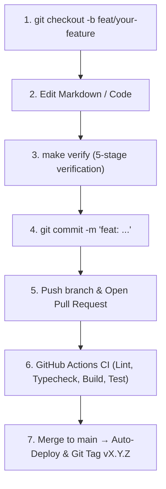
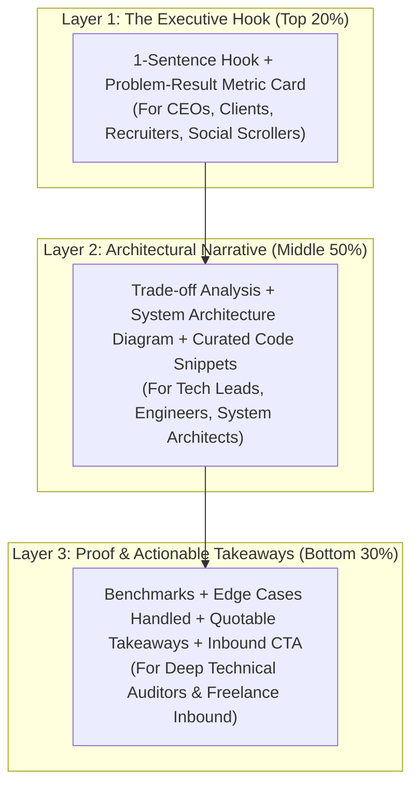

# Contributor & Agent Engineering Guide

Welcome to the **`mrxsierra.github.io`** repository. This document provides a concise, developer-first reference on repository architecture, local setup, development workflows, quality gates, and SDLC practices for human developers and autonomous AI coding agents.

---

## 1. Repository Layout

```text
├── docs/                      # Site markdown sources, assets, styles, & scripts
│   ├── assets/                # Static assets (images, icons, favicons, brand exports)
│   ├── blog/                  # Blog post articles and index
│   ├── brand/                 # Geometric Brand Standards portal & vector mark downloads
│   ├── cert/                  # Professional accreditation certificates
│   ├── javascripts/           # Client-side custom scripts (index.js)
│   ├── press/                 # Official Media Press Kit & speaker assets
│   ├── projects/              # Featured project case studies & specs
│   ├── stylesheets/           # Custom CSS stylesheets (index.css, extra.css)
│   ├── templates/             # Production case study & blog post editorial templates
│   │   ├── project-template.md# Plug-and-play high-converting project case study template
│   │   └── blog-template.md   # Viral engineering thought-leadership article template
│   ├── changelog.md           # Site Changelog & release history page
│   ├── index.md               # Portfolio homepage
│   ├── llms.txt               # High-level AI discovery index (auto-generated)
│   └── llms-full.txt          # Concatenated AI knowledge base (auto-generated)
├── hooks/                     # MkDocs lifecycle hooks
│   ├── generate_ai_docs.py    # Auto-generates llms.txt and llms-full.txt pre-build
│   └── generate_rss_feed.py   # Auto-generates multi-channel RSS feeds post-build
├── overrides/                 # Material for MkDocs template overrides
│   ├── main.html              # Custom head tags (RSS auto-discovery, OpenGraph, Twitter cards)
│   └── partials/              # Custom layout partials
│       ├── copyright.html     # Footer partial embedding active version tag & changelog link
│       └── social_share.html  # 8-platform responsive social sharing & copy toast widget
├── scripts/                   # Developer automation & verification tooling
│   ├── brand_engine/          # Modular vector generation & press archive compiler
│   │   ├── cli.py             # User-friendly CLI tool (`python scripts/brand_engine/cli.py --all`)
│   │   ├── config.py          # Single source of truth (colors, typography, bios, dimensions)
│   │   ├── vector_builder.py  # Mathematical SVG generator (monograms, banners, watermarks)
│   │   ├── rasterizer.py      # High-density ImageMagick wrapper (PNGs, multi-res ICOs)
│   │   └── packager.py        # Automated Press Kit ZIP packager
│   ├── bump_version.py        # SemVer bumper (updates VERSION, pyproject.toml, mkdocs.yml, CHANGELOG.md)
│   ├── install_hooks.py       # Git pre-commit hook installer
│   ├── setup_github_ruleset.sh# GitHub Repository Ruleset installer via gh CLI
│   └── verify.py              # 5-stage pre-commit verification pipeline
├── tests/                     # Automated pytest verification test suite (55 tests)
│   ├── conftest.py            # Pytest session fixtures (cached strict build & BeautifulSoup parsers)
│   ├── test_brand_kit.py      # Vector marks, raster assets, banners, & press kit archive integrity
│   ├── test_hooks.py          # Build hook unit tests & llms.txt format checks
│   ├── test_html_integrity.py # Link checker, DOM semantics, & template leak checks
│   ├── test_smoke.py          # Core HTML pages, sitemaps, RSS feeds, & static asset smoke tests
│   ├── test_social_sharing.py # OpenGraph tags, social share widget, & RSS feed XML schema tests
│   └── test_versioning.py     # SemVer synchronization, parser, & bump calculation tests
├── .github/
│   ├── ISSUE_TEMPLATE/        # GitHub structured issue forms (bug_report.yml, feature_request.yml)
│   ├── rulesets/
│   │   └── main-protection.json # GitHub repository branch protection ruleset definition
│   ├── workflows/
│   │   └── ci.yml             # Multi-stage CI/CD pipeline (Lint, Types, Build, Test, Deploy, Tag)
│   └── PULL_REQUEST_TEMPLATE.md # PR template with change classification & verification checklist
├── .githooks/
│   └── pre-commit             # Git pre-commit hook runner with main branch protection guard
├── CHANGELOG.md               # Standard Keep a Changelog document
├── CONTRIBUTING.md            # Contributor & AI agent engineering guide
├── Makefile                   # Standard developer shortcuts
├── mkdocs.yml                 # Main MkDocs Material configuration
├── pyproject.toml             # Python dependencies, Ruff, Mypy, and Pytest configs
└── VERSION                    # Single source of truth SemVer version string
```

---

## 2. Quickstart & Local Environment

### Prerequisites
- Python 3.12+
- Git

### Setup
```bash
# 1. Create and activate virtual environment
python -m venv .venv
source .venv/bin/activate

# 2. Install all core & dev dependencies
pip install -r requirements.txt
pip install beautifulsoup4 mypy pytest ruff types-PyYAML types-beautifulsoup4 types-requests

# 3. Install git pre-commit verification hook
make hook-install
# or: git config core.hooksPath .githooks
```

---

## 3. Branch Protection & Development Workflow

> [!IMPORTANT]
> Direct commits to the `main` branch are restricted both locally and on GitHub to prevent accidental breakage and ensure every change passes full automated verification.



### Working on Changes
1. **Always create a feature/fix branch**:
   ```bash
   git checkout -b feat/new-case-study
   # or: git checkout -b fix/broken-link
   # or: git checkout -b chore/dependency-update
   ```
2. **Local Pre-Commit Guard**: If you attempt to commit on `main`, `.githooks/pre-commit` will block the commit with an explanatory message. *(Emergency bypass: `ALLOW_MAIN_COMMIT=1 git commit`).*
3. **GitHub Rulesets**: Merging into `main` requires all CI checks (`validate` job) to pass.

---

## 4. Content Authoring Standards & Editorial Framework

To simultaneously attract **freelance clients**, **job recruiters**, **technical leads**, and achieve **cross-platform social virality**, content must adhere to the **"Dual-Depth Inverted Pyramid"**:



### A. Authoring Portfolio Project Case Studies
- **Template Location**: [`docs/templates/project-template.md`](docs/templates/project-template.md)
- **Primary Goal**: Convert traffic into inbound freelance contracts and engineering job offers.
- **Key Requirements**:
  1. **Hero Metadata**: Role, timeline, tech stack chips, client/org context, and GitHub source/demo links.
  2. **Executive Summary & 3-Metric Stat Card**: Quantifiable impact (e.g. `900K+ Records Analyzed`, `40% Latency Reduction`).
  3. **Architecture Diagrams**: High-clarity Mermaid or SVG data flow diagram.
  4. **Decision Matrix**: "Why We Chose X over Y" (e.g. SQLite vs PostgreSQL, Redis vs Memcached).
  5. **Curated Code Highlights**: High-leverage 15–30 line snippets (no massive code dumps).
  6. **Automated Verification**: Pytest pass rates, benchmark latency numbers, edge-case handling.
  7. **Clear Inbound CTA**: Contact button directing prospective clients to discuss projects.

### B. Authoring Viral Engineering Blog Posts
- **Template Location**: [`docs/templates/blog-template.md`](docs/templates/blog-template.md)
- **Primary Goal**: Thought leadership, social distribution across X/LinkedIn/Reddit, and organic inbound growth.
- **Key Requirements**:
  1. **Provocative Hook & Title**: Challenge a common assumption or share a hard-won production fix.
  2. **30-Second TL;DR Card**: Problem $\rightarrow$ Discovery $\rightarrow$ Production Solution.
  3. **Mental Model & Flow Diagram**: Visual simplification of complex concepts.
  4. **"Do This, Not That" Diffs**: Anti-pattern vs production-grade pattern with syntax highlighting.
  5. **Production Gotchas**: 3 non-obvious traps that only happen under real load.
  6. **Quotable Summary**: Punchy takeaway bullets designed for screenshotting and sharing.

### C. Cross-Platform Distribution Matrix

| Platform | Format & Hook Strategy | Content Adaptation |
| :--- | :--- | :--- |
| **X (Twitter)** | **Multi-Tweet Thread**: Hook tweet with diagram image $\rightarrow$ 3 core lessons $\rightarrow$ Link | Extract TL;DR bullets, diagram SVG, and quotable takeaways. |
| **LinkedIn** | **Story Post**: Problem $\rightarrow$ Production obstacle $\rightarrow$ Business/Architecture insight $\rightarrow$ Takeaways | Frame around engineering leadership, reliability, and business impact. |
| **Dev.to / Medium** | **Syndicated Article**: Full markdown post with canonical URL pointing back to `mrxsierra.github.io` | Direct copy of blog post; set canonical link to avoid SEO duplication. |
| **Reddit (r/Python, r/webdev)** | **Value-First Self-Post**: Comprehensive text tutorial without aggressive self-promotion | Post the practical code breakdown and problem context directly in Reddit markdown. |

---

## 5. Daily Development Workflows

### Live Preview Server
```bash
make serve
# Starts dev server with live reload at http://127.0.0.1:8000
```

### Adding New Case Studies & Articles
1. **New Project**: Copy `docs/templates/project-template.md` $\rightarrow$ `docs/projects/your-project.md`, fill out sections, and add to `nav` in `mkdocs.yml`.
2. **New Blog Post**: Copy `docs/templates/blog-template.md` $\rightarrow$ `docs/blog/posts/YYYY-MM-DD-slug.md`, customize frontmatter, and preview locally.

### Brand Asset & Press Kit Engine
To compile vector SVGs, multi-density favicons, YouTube watermarks, and package the master zip press kit:
```bash
make brand
# or: python scripts/brand_engine/cli.py --all
# Subcommands: --vectors, --favicons, --watermarks, --banners, --zip
```

### Build Hooks & Dynamic Endpoints
- **AI Documentation (`hooks/generate_ai_docs.py`)**: Runs pre-build to generate [`llms.txt`](https://mrxsierra.github.io/llms.txt) and [`llms-full.txt`](https://mrxsierra.github.io/llms-full.txt) per [llmstxt.org](https://llmstxt.org).
- **Multi-Channel RSS Feeds (`hooks/generate_rss_feed.py`)**: Runs post-build to generate valid W3C RSS 2.0 XML feeds (`feed.xml`, `feed_blog.xml`, `feed_projects.xml`).
- **Social Sharing Widget (`overrides/partials/social_share.html`)**: Injects an 8-platform responsive share bar with toast copy notifications on articles and project case studies.

---

## 6. Quality Verification & Testing Gate

Before committing changes, **always run the verification engine**:

```bash
make verify
# or: python scripts/verify.py
```

### Verification Pipeline Stages:
1. **Ruff Lint Check (`ruff check .`)**: Enforces Python code style, unused imports, and syntax cleanliness.
2. **Ruff Format Check (`ruff format --check .`)**: Validates uniform code formatting.
3. **Mypy Static Analysis (`mypy hooks scripts tests`)**: Strict Python type checking.
4. **MkDocs Strict Build (`mkdocs build --strict`)**: Builds the site treating all warnings as errors.
5. **Pytest Verification Suite (`pytest tests/ -v`, 55 tests)**:
   - **`test_brand_kit.py`**: Validates vector marks, raster assets, video watermarks, social banners, and master press kit archive integrity.
   - **`test_smoke.py`**: Asserts existence and non-empty sizes of all core HTML pages, sitemaps, RSS feeds, stylesheets, scripts, and favicon.
   - **`test_html_integrity.py`**: Scans all built HTML for zero broken internal links, zero missing media assets, valid DOM semantics (`<!DOCTYPE>`, `<title>`, `<meta name="viewport">`), and zero unrendered template placeholders (`{{ ... }}`).
   - **`test_hooks.py`**: Verifies HTML-to-markdown sanitization and `llms.txt` / `llms-full.txt` format compliance.
   - **`test_social_sharing.py`**: Validates OpenGraph / Twitter Card tags, social sharing widget single-instance rendering, and W3C RSS 2.0 XML feed schema compliance.
   - **`test_versioning.py`**: Asserts synchronization across `VERSION`, `pyproject.toml`, `mkdocs.yml`, and `CHANGELOG.md`, and validates SemVer bumper calculations.

### Individual Commands
```bash
make test         # Run full 49-test pytest suite
make lint         # Run Ruff lint & formatting checks
make format       # Auto-format Python code and fix lint issues
make typecheck    # Run Mypy static type analysis
make build        # Run strict MkDocs build
```

---

## 7. Semantic Versioning & SDLC Release Process

This project follows [Semantic Versioning (SemVer)](https://semver.org/) with a single source of truth in the `VERSION` file:

### Versioning Tiers:
| Version Level | Pattern | Trigger / Flow | Description |
| :--- | :--- | :--- | :--- |
| **Patch** | `0.X.Y` | Commits on `main` / `fix:` / `chore:` | Bug fixes, typo corrections, dependency updates (`make bump-patch`) |
| **Minor** | `0.X.0` | **Feature PR to `main`** (`feat:`, `feat/*`) | New project case study, interactive component, brand update, or major blog post (`make bump-minor`) |
| **Major** | `X.0.0` | **Manual** (`make bump-major`) | Complete architectural redesign or major milestone launch |

### Version Management Commands:
```bash
make version      # Display current version from VERSION file
make bump-patch   # Increment patch version (0.X.Y)
make bump-minor   # Increment minor version (0.X.0) & reset patch
make bump-major   # Increment major version (X.0.0) & reset minor/patch
```

---

## 8. AI Agent Guidelines

When an AI coding assistant operates on this repository:
- **Single Source of Truth**: Keep `VERSION`, `pyproject.toml`, `mkdocs.yml`, and `CHANGELOG.md` synchronized.
- **Branch Protection**: Never attempt direct commits to `main`; always branch off into a feature or chore branch.
- **Use Official Templates**: When creating new projects or blog posts, base them on `docs/templates/project-template.md` and `docs/templates/blog-template.md`.
- **Zero Broken Links**: Never use ad-hoc raw paths that bypass MkDocs slug resolution; run `make verify` to confirm link integrity.
- **Maintain Typing**: All Python scripts and hooks must have explicit type annotations passing Mypy.
- **Run Verification Before Completion**: Always execute `python scripts/verify.py` before finalizing any task.
