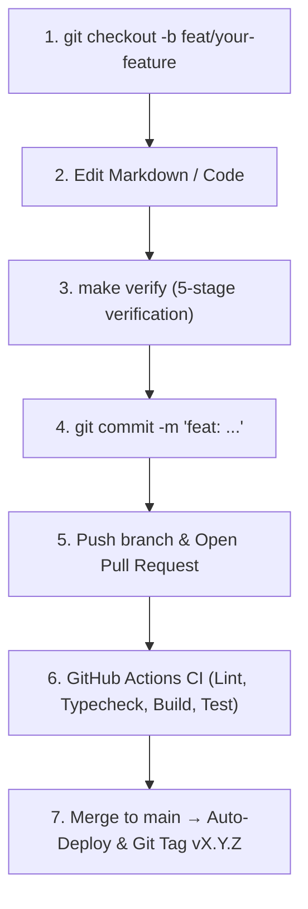

# Contributor & Agent Engineering Guide

Welcome to the **`mrxsierra.github.io`** repository. This document provides a concise, developer-first reference on repository architecture, local setup, development workflows, quality gates, and SDLC practices for human developers and autonomous AI coding agents.

---

## 1. Repository Layout

```text
├── docs/                      # Site markdown sources, assets, styles, & scripts
│   ├── assets/                # Static assets (images, icons, favicons, brand exports)
│   ├── blog/                  # Blog post articles and index
│   ├── brand/                 # Geometric Brand Standards portal & vector mark downloads
│   ├── cert/                  # Professional accreditation certificates
│   ├── javascripts/           # Client-side custom scripts (index.js)
│   ├── press/                 # Official Media Press Kit & speaker assets
│   ├── projects/              # Featured project case studies & specs
│   ├── stylesheets/           # Custom CSS stylesheets (index.css, extra.css)
│   ├── changelog.md           # Site Changelog & release history page
│   ├── index.md               # Portfolio homepage
│   ├── llms.txt               # High-level AI discovery index (auto-generated)
│   └── llms-full.txt          # Concatenated AI knowledge base (auto-generated)
├── hooks/                     # MkDocs lifecycle hooks
│   ├── generate_ai_docs.py    # Auto-generates llms.txt and llms-full.txt pre-build
│   └── generate_rss_feed.py   # Auto-generates multi-channel RSS feeds post-build
├── overrides/                 # Material for MkDocs template overrides
│   ├── main.html              # Custom head tags (RSS auto-discovery, OpenGraph, Twitter cards)
│   └── partials/              # Custom layout partials
│       ├── copyright.html     # Footer partial embedding active version tag & changelog link
│       └── social_share.html  # 8-platform responsive social sharing & copy toast widget
├── scripts/                   # Developer automation & verification tooling
│   ├── brand_engine/          # Automated SVG vector generation & press archive packager
│   │   └── generate_brand_assets.py # Generates monograms, lockups, favicons, and zip
│   ├── bump_version.py        # SemVer bumper (updates VERSION, pyproject.toml, mkdocs.yml, CHANGELOG.md)
│   ├── install_hooks.py       # Git pre-commit hook installer
│   ├── setup_github_ruleset.sh# GitHub Repository Ruleset installer via gh CLI
│   └── verify.py              # 5-stage pre-commit verification pipeline
├── tests/                     # Automated pytest verification test suite (49 tests)
│   ├── conftest.py            # Pytest session fixtures (cached strict build & BeautifulSoup parsers)
│   ├── test_brand_kit.py      # Vector marks, raster assets, banners, & press kit archive integrity
│   ├── test_hooks.py          # Build hook unit tests & llms.txt format checks
│   ├── test_html_integrity.py # Link checker, DOM semantics, & template leak checks
│   ├── test_smoke.py          # Core HTML pages, sitemaps, RSS feeds, & static asset smoke tests
│   ├── test_social_sharing.py # OpenGraph tags, social share widget, & RSS feed XML schema tests
│   └── test_versioning.py     # SemVer synchronization, parser, & bump calculation tests
├── .github/
│   ├── ISSUE_TEMPLATE/        # GitHub structured issue forms (bug_report.yml, feature_request.yml)
│   ├── rulesets/
│   │   └── main-protection.json # GitHub repository branch protection ruleset definition
│   ├── workflows/
│   │   └── ci.yml             # Multi-stage CI/CD pipeline (Lint, Types, Build, Test, Deploy, Tag)
│   └── PULL_REQUEST_TEMPLATE.md # PR template with change classification & verification checklist
├── .githooks/
│   └── pre-commit             # Git pre-commit hook runner with main branch protection guard
├── CHANGELOG.md               # Standard Keep a Changelog document
├── CONTRIBUTING.md            # Contributor & AI agent engineering guide
├── Makefile                   # Standard developer shortcuts
├── mkdocs.yml                 # Main MkDocs Material configuration
├── pyproject.toml             # Python dependencies, Ruff, Mypy, and Pytest configs
└── VERSION                    # Single source of truth SemVer version string
```

---

## 2. Quickstart & Local Environment

### Prerequisites
- Python 3.12+
- Git

### Setup
```bash
# 1. Create and activate virtual environment
python -m venv .venv
source .venv/bin/activate

# 2. Install all core & dev dependencies
pip install -r requirements.txt
pip install beautifulsoup4 mypy pytest ruff types-PyYAML types-beautifulsoup4 types-requests

# 3. Install git pre-commit verification hook
make hook-install
# or: git config core.hooksPath .githooks
```

---

## 3. Branch Protection & Development Workflow

> [!IMPORTANT]
> Direct commits to the `main` branch are restricted both locally and on GitHub to prevent accidental breakage and ensure every change passes full automated verification.



### Working on Changes
1. **Always create a feature/fix branch**:
   ```bash
   git checkout -b feat/new-case-study
   # or: git checkout -b fix/broken-link
   # or: git checkout -b chore/dependency-update
   ```
2. **Local Pre-Commit Guard**: If you attempt to commit on `main`, `.githooks/pre-commit` will block the commit with an explanatory message. *(Emergency bypass: `ALLOW_MAIN_COMMIT=1 git commit`).*
3. **GitHub Rulesets**: Merging into `main` requires all CI checks (`validate` job) to pass.

---

## 4. Daily Development Workflows

### Live Preview Server
```bash
make serve
# Starts dev server with live reload at http://127.0.0.1:8000
```

### Adding / Editing Content
1. **Homepage (`docs/index.md`)**: Custom developer layout, terminal preview widget, and profile cards.
2. **Project Case Studies (`docs/projects/<name>.md`)**: Include in `mkdocs.yml` navigation under `Projects`.
3. **Brand & Press Portals (`docs/brand/index.md`, `docs/press/index.md`)**: Maintain brand token definitions, usage guidance, and authorized speaker media kits.
4. **Blog Posts (`docs/blog/posts/<name>.md`)**:
   - Provide standard YAML frontmatter:
     ```yaml
     ---
     date:
       created: YYYY-MM-DD
     authors: [mrxsierra]
     categories:
       - Category Name
     tags:
       - Tag1
       - Tag2
     slug: your-custom-slug
     description: Concise summary of the article.
     ---
     ```
   - Use standard markdown links for inter-page navigation (e.g. `[Next Post](other-post.md)`).
5. **Changelog (`CHANGELOG.md`)**:
   - Record changes under `## [Unreleased]` or version headers following [Keep a Changelog](https://keepachangelog.com/en/1.1.0/).
   - `hooks/generate_ai_docs.py` automatically synchronizes `docs/changelog.md` from `CHANGELOG.md` on every build.

### Brand Asset & Press Kit Engine
To compile vector SVGs, multi-density favicons, YouTube watermarks, and package the master zip press kit:
```bash
python scripts/brand_engine/generate_brand_assets.py
# Outputs vector assets to docs/assets/brand/ and builds docs/assets/brand/mrxsierra-brand-press-kit.zip
```

### Build Hooks & Dynamic Endpoints
- **AI Documentation (`hooks/generate_ai_docs.py`)**: Runs pre-build to generate [`llms.txt`](https://mrxsierra.github.io/llms.txt) and [`llms-full.txt`](https://mrxsierra.github.io/llms-full.txt) per [llmstxt.org](https://llmstxt.org).
- **Multi-Channel RSS Feeds (`hooks/generate_rss_feed.py`)**: Runs post-build to generate valid W3C RSS 2.0 XML feeds:
  - Combined Feed: `site/feed.xml`, `site/feed_rss_created.xml`, `site/feed_rss_updated.xml`
  - Blog-Only Feed: `site/feed_blog.xml`, `site/blog/feed_rss_created.xml`
  - Projects-Only Feed: `site/feed_projects.xml`, `site/projects/feed_rss_created.xml`
- **Social Sharing Widget (`overrides/partials/social_share.html`)**: Injects an 8-platform responsive share bar with toast copy notifications on articles and project case studies.

---

## 5. Quality Verification & Testing Gate

Before committing changes, **always run the verification engine**:

```bash
make verify
# or: python scripts/verify.py
```

### Verification Pipeline Stages:
1. **Ruff Lint Check (`ruff check .`)**: Enforces Python code style, unused imports, and syntax cleanliness.
2. **Ruff Format Check (`ruff format --check .`)**: Validates uniform code formatting.
3. **Mypy Static Analysis (`mypy hooks scripts tests`)**: Strict Python type checking.
4. **MkDocs Strict Build (`mkdocs build --strict`)**: Builds the site treating all warnings as errors.
5. **Pytest Verification Suite (`pytest tests/ -v`, 49 tests)**:
   - **`test_brand_kit.py`**: Validates vector marks, raster assets, video watermarks, social banners, and master press kit archive integrity.
   - **`test_smoke.py`**: Asserts existence and non-empty sizes of all core HTML pages, sitemaps, RSS feeds, stylesheets, scripts, and favicon.
   - **`test_html_integrity.py`**: Scans all built HTML for zero broken internal links, zero missing media assets, valid DOM semantics (`<!DOCTYPE>`, `<title>`, `<meta name="viewport">`), and zero unrendered template placeholders (`{{ ... }}`).
   - **`test_hooks.py`**: Verifies HTML-to-markdown sanitization and `llms.txt` / `llms-full.txt` format compliance.
   - **`test_social_sharing.py`**: Validates OpenGraph / Twitter Card tags, social sharing widget single-instance rendering, and W3C RSS 2.0 XML feed schema compliance.
   - **`test_versioning.py`**: Asserts synchronization across `VERSION`, `pyproject.toml`, `mkdocs.yml`, and `CHANGELOG.md`, and validates SemVer bumper calculations.

### Individual Commands
```bash
make test         # Run full 49-test pytest suite
make lint         # Run Ruff lint & formatting checks
make format       # Auto-format Python code and fix lint issues
make typecheck    # Run Mypy static type analysis
make build        # Run strict MkDocs build
```

---

## 6. Semantic Versioning & SDLC Release Process

This project follows [Semantic Versioning (SemVer)](https://semver.org/) with a single source of truth in the `VERSION` file:

### Versioning Tiers:
| Version Level | Pattern | Trigger / Flow | Description |
| :--- | :--- | :--- | :--- |
| **Patch** | `0.X.Y` | Commits on `main` / `fix:` / `chore:` | Bug fixes, typo corrections, dependency updates (`make bump-patch`) |
| **Minor** | `0.X.0` | **Feature PR to `main`** (`feat:`, `feat/*`) | New project case study, interactive component, brand update, or major blog post (`make bump-minor`) |
| **Major** | `X.0.0` | **Manual** (`make bump-major`) | Complete architectural redesign or major milestone launch |

### Version Management Commands:
```bash
make version      # Display current version from VERSION file
make bump-patch   # Increment patch version (0.X.Y)
make bump-minor   # Increment minor version (0.X.0) & reset patch
make bump-major   # Increment major version (X.0.0) & reset minor/patch
```

### Conventional Commits:
When creating a PR or committing, use conventional prefixes:
- `feat:` New project case study, brand update, page, or feature (triggers Minor bump on PR merge)
- `fix:` Broken link repair, layout bug fix, or script correction (Patch bump)
- `docs:` Documentation or technical article update
- `refactor:` Code restructuring
- `chore:` Dependency update or maintenance

---

## 7. AI Agent Guidelines

When an AI coding assistant operates on this repository:
- **Single Source of Truth**: Keep `VERSION`, `pyproject.toml`, `mkdocs.yml`, and `CHANGELOG.md` synchronized.
- **Branch Protection**: Never attempt direct commits to `main`; always branch off into a feature or chore branch.
- **Zero Broken Links**: Never use ad-hoc raw paths that bypass MkDocs slug resolution; run `make verify` to confirm link integrity.
- **Maintain Typing**: All Python scripts and hooks must have explicit type annotations passing Mypy.
- **Run Verification Before Completion**: Always execute `python scripts/verify.py` before finalizing any task.
