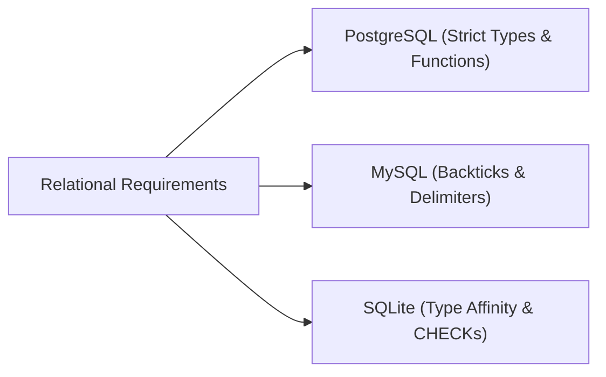

---
date:
  created: 2025-05-07
authors: [mrxsierra]
categories:
  - Database Architecture
tags:
  - SQL
  - PostgreSQL
  - MySQL
  - SQLite
  - Schema Design
slug: navigating-the-nuances-a-developers-guide-to-sql-dialects-sqlite-mysql-postgresql
description: >
  A comparative guide to SQL dialects (SQLite, MySQL, and PostgreSQL) covering schema definition, auto-increment keys, trigger procedures, and type systems.
---

# Navigating the Nuances: A Developer's Guide to SQL Dialects (SQLite, MySQL, PostgreSQL)

As developers, we frequently encounter diverse SQL engines. While core relational concepts are standardized, critical divergences emerge in schema definitions, data types, and procedural extensions like triggers.

<!-- more -->

<div class="series-banner">
  <div class="series-banner-header">
    <span class="series-badge">2-Part Engineering Series</span>
    <span style="font-size: 12.5px; color: var(--color-text-muted);">Part 1 of 2</span>
  </div>
  <div style="font-size: 13.5px; color: var(--color-text-secondary); line-height: 1.5;">
    <strong>Part 1:</strong> Schema Definitions, DDL, &amp; Trigger Architecture (Current)<br>
    <strong>Part 2:</strong> <a href="../2-query-interaction-diff/">Beyond the Schema: Querying, CLI Interaction, &amp; Docker Nuances</a>
  </div>
</div>

This technical reference draws directly from real-world multi-database migrations implemented in the [**Examination Management System (EMS DB)**](https://github.com/mrxsierra/ems-db/) repository.

---

## Key Areas of Schema Divergence



### 1. Dropping Objects (Tables, Views, Indexes)

The syntax for dropping database objects is broadly compatible, but identifier quoting rules differ.

=== "PostgreSQL"

    ```sql
    -- Double quotes for case sensitivity and identifier safety
    DROP VIEW IF EXISTS "tests_history";
    DROP TABLE IF EXISTS "students" CASCADE;
    ```

=== "MySQL"

    ```sql
    -- Backtick quoting standard
    DROP VIEW IF EXISTS `tests_history`;
    DROP TABLE IF EXISTS `students`;
    ```

=== "SQLite"

    ```sql
    -- Double quotes supported, basic IF EXISTS
    DROP VIEW IF EXISTS "tests_history";
    DROP TABLE IF EXISTS "students";
    ```

---

### 2. Primary Keys, Auto-Increment, &amp; Types

| Feature | SQLite | PostgreSQL | MySQL |
|:---|:---|:---|:---|
| **Auto-Increment ID** | `INTEGER PRIMARY KEY` (implicitly sequential) | `SERIAL PRIMARY KEY` or `IDENTITY` | `INT AUTO_INCREMENT PRIMARY KEY` |
| **Text Fields** | `TEXT` | `VARCHAR(n)`, `TEXT` | `VARCHAR(n)`, `TEXT` |
| **Boolean** | `INTEGER CHECK ("is_correct" IN (0, 1))` | Native `BOOLEAN` or `SMALLINT` | `TINYINT(1)` |
| **Date/Time** | `NUMERIC` (`DATETIME('now', 'localtime')`) | `TIMESTAMP WITH TIME ZONE` | `DATETIME`, `CURRENT_TIMESTAMP` |
| **ENUM Types** | Simulated via `CHECK ("status" IN (...))` | Native `CREATE TYPE ... AS ENUM` | Inline column `ENUM('active', ...)` |

#### Table ID Definition

=== "PostgreSQL"

    ```sql
    CREATE TABLE IF NOT EXISTS "students" (
        "id" SERIAL,
        "first_name" VARCHAR(50) NOT NULL,
        "last_name" VARCHAR(50) NOT NULL,
        PRIMARY KEY ("id")
    );
    ```

=== "MySQL"

    ```sql
    CREATE TABLE IF NOT EXISTS `students` (
        `id` INT AUTO_INCREMENT,
        `first_name` VARCHAR(50) NOT NULL,
        `last_name` VARCHAR(50) NOT NULL,
        PRIMARY KEY (`id`)
    );
    ```

=== "SQLite"

    ```sql
    CREATE TABLE "students" (
        "id" INTEGER,
        "first_name" TEXT NOT NULL,
        "last_name" TEXT NOT NULL,
        PRIMARY KEY ("id")
    );
    ```

#### ENUM &amp; Constrained Types

=== "PostgreSQL"

    ```sql
    -- 1. Declare domain type
    CREATE TYPE "tests_session_status_type" AS ENUM ('in-progress', 'ended', 'completed');

    -- 2. Use type in table definition
    CREATE TABLE IF NOT EXISTS "tests_sessions" (
        "id" SERIAL PRIMARY KEY,
        "status" "tests_session_status_type" NOT NULL DEFAULT 'in-progress'
    );
    ```

=== "MySQL"

    ```sql
    -- Native column-level ENUM definition
    CREATE TABLE IF NOT EXISTS `tests_sessions` (
        `id` INT AUTO_INCREMENT PRIMARY KEY,
        `status` ENUM ('in-progress', 'ended', 'completed') NOT NULL DEFAULT 'in-progress'
    );
    ```

=== "SQLite"

    ```sql
    -- Simulated using TEXT with CHECK constraint
    CREATE TABLE "tests_sessions" (
        "id" INTEGER PRIMARY KEY,
        "status" TEXT NOT NULL DEFAULT 'in-progress' CHECK (
            "status" IN ('in-progress', 'ended', 'completed')
        )
    );
    ```

---

### 3. Trigger Architecture &amp; Execution

Triggers represent the most significant syntactical divide across the three engines.

**Objective:** Compute and set the `end` timestamp of a `tests_sessions` row upon creation based on test duration.

=== "PostgreSQL"

    ```sql
    -- PostgreSQL mandates separating procedural function from trigger binding
    CREATE OR REPLACE FUNCTION set_end_for_test_session_fn()
    RETURNS TRIGGER AS $$
    BEGIN
        NEW.end := NEW.start + (
            SELECT "duration" FROM "tests" WHERE "id" = NEW.test_id
        );
        RETURN NEW;
    END;
    $$ LANGUAGE plpgsql;

    CREATE TRIGGER "set_end_for_test_session"
    BEFORE INSERT ON "tests_sessions"
    FOR EACH ROW
    EXECUTE FUNCTION set_end_for_test_session_fn();
    ```

=== "MySQL"

    ```sql
    -- MySQL requires custom statement DELIMITERs
    DELIMITER $$
    CREATE TRIGGER `set_end_for_test_session`
    BEFORE INSERT ON `tests_sessions`
    FOR EACH ROW
    BEGIN
        SET NEW.end = DATE_ADD(
            IFNULL(NEW.start, NOW()),
            INTERVAL (
                SELECT TIME_TO_SEC(`duration`) / 60
                FROM `tests`
                WHERE `id` = NEW.`test_id`
            ) MINUTE
        );
    END$$
    DELIMITER ;
    ```

=== "SQLite"

    ```sql
    -- SQLite embeds block logic directly in the trigger definition
    CREATE TRIGGER "set_end_for_test_session"
    AFTER INSERT ON "tests_sessions"
    BEGIN
        UPDATE "tests_sessions"
        SET "end" = DATETIME(new.start, '+' || (
            SELECT TIME(duration)
            FROM "tests" AS t
            WHERE t."id" = new."test_id"
        ))
        WHERE "id" = new.id;
    END;
    ```

---

### 4. Timestamp &amp; Interval Arithmetic

How intervals and timestamps are computed across engines:

=== "PostgreSQL"

    ```sql
    -- Native interval arithmetic
    NEW.start + (SELECT "duration" FROM "tests" WHERE "id" = NEW.test_id)
    ```

=== "MySQL"

    ```sql
    -- DATE_ADD with unit keyword
    DATE_ADD(NEW.start, INTERVAL (SELECT TIME_TO_SEC(`duration`) / 60 FROM `tests` WHERE `id` = NEW.`test_id`) MINUTE)
    ```

=== "SQLite"

    ```sql
    -- String modifier concatenation inside DATETIME()
    DATETIME(new.start, '+' || (SELECT TIME(duration) FROM "tests" WHERE "id" = new.test_id))
    ```

---

### 5. Conditional Expressions

=== "PostgreSQL"

    ```sql
    -- Native IF/ELSE inside procedural functions
    IF NEW.score = 0 THEN
        NEW.feedback := 'need-improvement';
    ELSE
        NEW.feedback := 'great';
    END IF;
    ```

=== "MySQL"

    ```sql
    -- Standard CASE statement
    SET NEW.feedback = CASE
        WHEN NEW.score = 0 THEN 'need-improvement'
        ELSE 'great'
    END;
    ```

=== "SQLite"

    ```sql
    -- Inline CASE expression
    "feedback" = CASE
        WHEN new.score = 0 THEN 'need-improvement'
        ELSE 'great'
    END
    ```

---

### 6. Aggregate NULL Handling

When aggregating nullable scores (`SUM`), empty record sets return `NULL` unless coalesced:

=== "PostgreSQL"

    ```sql
    SELECT COALESCE(SUM("score"), 0) FROM "results" WHERE "test_session_id" = NEW.id;
    ```

=== "MySQL"

    ```sql
    SELECT IFNULL(SUM(`score`), 0) FROM `results` WHERE `test_session_id` = NEW.id;
    ```

=== "SQLite"

    ```sql
    SELECT IFNULL(SUM("score"), 0) FROM "results" WHERE "test_session_id" = new.id;
    ```

---

## Architectural Comparison Matrix

| Feature | PostgreSQL | MySQL | SQLite |
|:---|:---|:---|:---|
| **Identifier Quoting** | `"identifier"` | `` `identifier` `` | `"identifier"` / `[identifier]` |
| **Auto-Increment Strategy** | Sequence / `IDENTITY` | Table attribute `AUTO_INCREMENT` | Table attribute `AUTOINCREMENT` |
| **Procedural Logic** | `PL/pgSQL` (Separate function) | `DELIMITER` blocks inside trigger | `BEGIN...END` inside trigger |
| **Interval Typing** | Native `INTERVAL` | `INTERVAL val UNIT` functions | String modifier parsing |
| **Strict Typing** | Highly strict &amp; extensible | Strict with mode flags | Type affinity (permissive) |

---

## Next in the Series

<div class="series-banner" style="border-left-color: var(--color-accent);">
  <div class="series-banner-header">
    <span class="series-badge">Next Article</span>
    <a href="../2-query-interaction-diff/" class="btn btn-secondary" style="padding: 4px 12px; font-size: 12.5px;">Read Part 2 &rarr;</a>
  </div>
  <p style="margin: 0; font-size: 13.5px; color: var(--color-text-secondary); line-height: 1.5;">
    <strong>Beyond the Schema: A Practical Guide to Querying and Interacting with SQLite, MySQL, &amp; PostgreSQL</strong><br>
    Explore CLI interaction patterns, script piping, Dockerized connection debugging, and Python multi-RDBMS driver integration.
  </p>
</div>

---

## Reference Repositories

- [Examination Management System DB (EMS DB)](https://github.com/mrxsierra/ems-db/): Production multi-dialect repository with complete DDL schemas, seed scripts, and automated test benches.
- [PostgreSQL Official Documentation](https://www.postgresql.org/docs/current/)
- [MySQL 8.4 Reference Manual](https://dev.mysql.com/doc/refman/8.4/en/)
- [SQLite Documentation](https://sqlite.org/lang.html)
