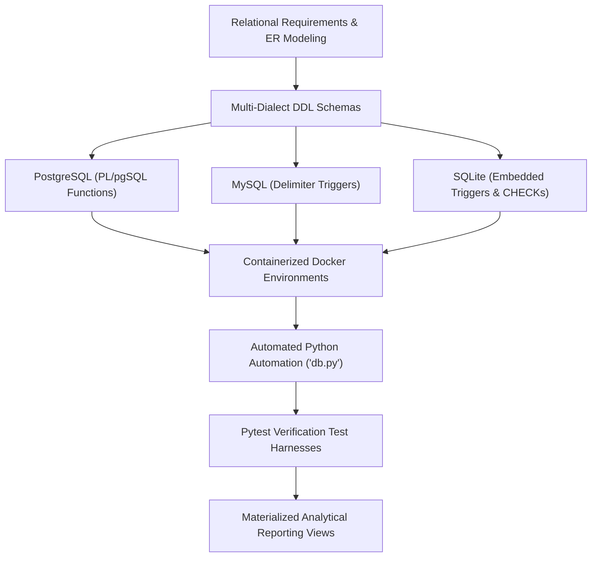
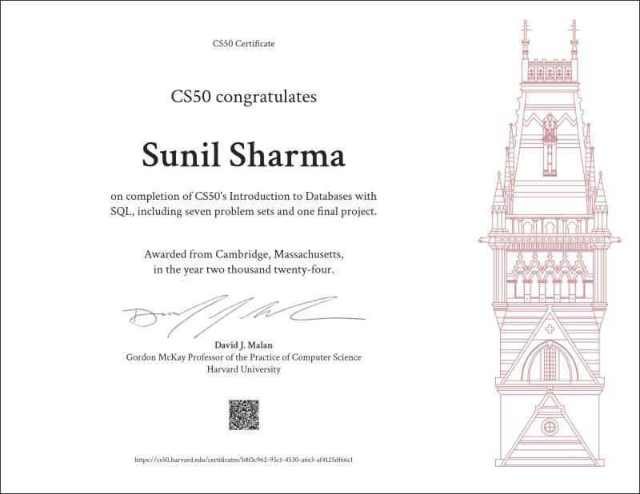

---
date:
  created: 2024-04-10
  updated: 2025-03-15
tags:
  - Database Design
  - Database Management
  - PostgreSQL
  - MySQL
  - SQLite
  - Python
  - Docker
description: >
  Production-grade multi-RDBMS academic examination platform with cross-engine parity across PostgreSQL, MySQL, and SQLite, Python automation, and Dockerized test workflows.
---

# Examination Management System DB

  

    

      Database Architecture • Multi-RDBMS Parity
      <h2 style="margin: 6px 0 0 0; font-size: 22px; font-weight: 700;">Examination Management System Database</h2>
    

    

      <a href="https://github.com/mrxsierra/ems-db" target="_blank" rel="noopener" class="btn btn-primary">
        <i class="fab fa-github"></i> Repository
      </a>
      <a href="https://youtu.be/CRT4_j3kZes" target="_blank" rel="noopener" class="btn btn-secondary">
        <i class="fab fa-youtube"></i> Video Walkthrough
      </a>
    

  

  

    

      Role
      Sole Database Architect &amp; Developer
    

    

      Supported Engines
      PostgreSQL 17, MySQL 8.4, SQLite 3
    

    

      Automation Stack
      Python, Pytest, Docker Compose, UV
    

    

      Accreditation
      Harvard CS50 SQL with Distinction
    

  

  

    <i class="fas fa-database"></i>
    <strong>Multi-Engine Consistency:</strong> 100% trigger and relational logic parity validated across PostgreSQL, MySQL, and SQLite using automated pytest test benches.
  

## Architecture &amp; Parity Pipeline

## Executive Overview

The **Examination Management System (EMS DB)** project is a modular, production-ready relational database architecture designed to administer educational examinations. It models students, proctors, tests, dynamic question banks, timed test sessions, audit events, and computed academic scores.

The architecture was engineered with strict **multi-RDBMS parity**: the system maintains three synchronized dialect implementations (**PostgreSQL**, **MySQL**, and **SQLite**) with automated Python test harnesses validating identical business logic execution across all three engines.

## Technical Challenges &amp; Architectural Solutions

### 1. Multi-Engine Relational &amp; Trigger Parity
- **Challenge:** Differences in dialect features (PL/pgSQL trigger functions vs MySQL delimiters vs SQLite embedded triggers) risked behavioral discrepancies.
- **Solution:** Designed modular directory hierarchies (`/psql`, `/mysql`, `/sqlite`) with corresponding migration scripts, automating query testing via engine-specific Python drivers (`psycopg2`, `mysql-connector-python`, `sqlite3`).

### 2. Temporal Logic &amp; Session Auto-Termination
- **Challenge:** Dynamically computing test session termination timestamps without race conditions.
- **Solution:** Implemented engine-native triggers (`set_end_for_test_session`) calculating interval arithmetic directly at write time based on test duration configurations.

### 3. Reporting Query Optimization
- **Challenge:** Heavy joins across student records, question options, and audit history caused query latency.
- **Solution:** Created targeted composite indexes and encapsulated analytical reporting logic into optimized SQL views (`tests_history`, `summary_reports`).

## Verified Accreditation

  
  

    Harvard CS50 SQL: Introduction to Databases with SQL • Harvard University (CS50)
  

## Entity Relationship Architecture

  

## Related Technical Deep Dives

- [**Navigating the Nuances: A Developer's Guide to SQL Dialects**](../blog/posts/1-schema-diff.md): Deep dive into DDL differences, autoincrement sequence strategies, and trigger syntax across SQLite, MySQL, and PostgreSQL.
- [**Beyond the Schema: Querying, CLI Interaction, &amp; Docker Nuances**](../blog/posts/2-query-interaction-diff.md): Practical patterns for script piping, container networking, and auto-increment resets.

<!-- Sequential Case Study Navigation -->

  <a href="../gstn-pbc/" class="project-nav-card">
    <i class="fas fa-arrow-left"></i> Previous Project
    GSTN Predictive Binary Classification
  </a>
  <a href="../s3-faker/" class="project-nav-card" style="text-align: right;">
    Next Project <i class="fas fa-arrow-right"></i>
    S3 Faker Mock Data Generator
  </a>

