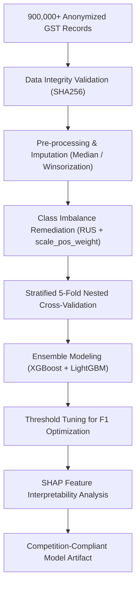
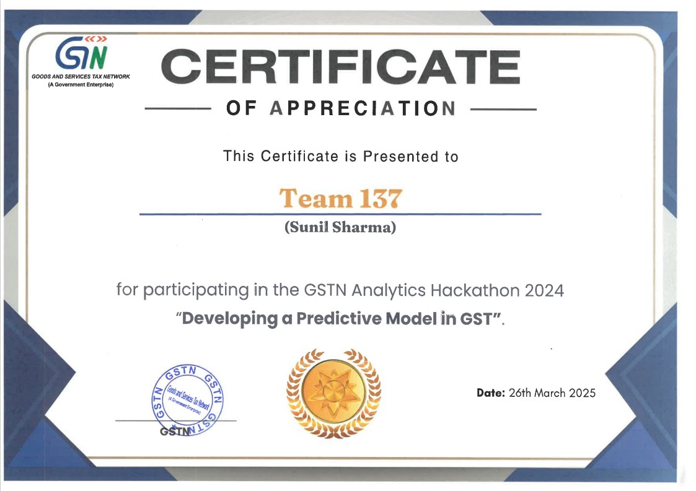

---
date:
  created: 2025-05-14
tags:
  - Machine Learning
  - Binary Classification
  - Python
  - Data Science
  - Hackathon
description: >
  National-level hackathon finalist machine learning pipeline analyzing 900,000+ real-world GST records with XGBoost, LightGBM, and SHAP explainability.
---

# GSTN Predictive Binary Classification

  

    

      Machine Learning • Competition Finalist
      <h2 style="margin: 6px 0 0 0; font-size: 22px; font-weight: 700;">GSTN AI/ML Analytics Challenge</h2>
    

    

      <a href="https://github.com/mrxsierra/gstn_dsp_pbc" target="_blank" rel="noopener" class="btn btn-primary">
        <i class="fab fa-github"></i> Repository
      </a>
      <a href="../../cert/GSTN_Team_137.jpg" class="btn btn-secondary" target="_blank">
        <i class="fas fa-award"></i> Certificate
      </a>
    

  

  

    

      Role
      Solo ML Engineer &amp; Lead
    

    

      Timeline
      Aug 2024 – Oct 2024 (45 Days)
    

    

      Dataset Scale
      900,000+ Records (21 Attributes)
    

    

      Primary Stack
      Python, XGBoost, LightGBM, SHAP
    

  

  

    <i class="fas fa-trophy"></i>
    <strong>Finalist Selection:</strong> Ranked among the top 17 finalist teams out of 200+ national participating teams as a single-member solo developer.
  

---

## Architecture &amp; ML Pipeline Flow

---

## Executive Overview

Developed for the **Goods and Services Tax Network (GSTN) AI/ML Hackathon** organized by the Government of India, this project engineered a high-throughput, interpretable binary classification pipeline for GST financial tax analytics.

The challenge required building an accurate predictive model $F_\theta(X) \to Y_{\text{pred}}$ over 900,000 real-world records characterized by severe class imbalance (91% majority / 9% minority) and extreme feature skewness, while adhering to strict zero-data-leakage compliance protocols.

---

## Technical Challenges &amp; Architectural Solutions

### 1. Severe Class Imbalance (91% / 9%)
- **Challenge:** Standard loss functions biased predictions toward the majority class, causing unacceptably low minority recall.
- **Solution:** Evaluated Random Under-Sampling (RUS), SMOTE, and tuned gradient boosted `scale_pos_weight` parameters to systematically optimize the Precision-Recall trade-off, maximizing both F1 and Matthews Correlation Coefficient (MCC).

### 2. Extreme Missingness &amp; Heavy-Tailed Skewness
- **Challenge:** Multiple tax feature columns exhibited >50% missing values and extreme financial outliers.
- **Solution:** Applied strict feature pruning thresholds, robust median imputation, and two-sided Winsorization to normalize distribution tails without sacrificing variance.

### 3. Data Leakage &amp; Generalization Safeguards
- **Challenge:** Risk of subtle data leakage across feature engineering and hyperparameter search.
- **Solution:** Enforced strict nested cross-validation and pipeline encapsulation (scikit-learn `Pipeline`) ensuring preprocessing transformations were fitted exclusively on training splits.

---

## Performance &amp; Evaluation Metrics

| Evaluation Metric | Cross-Validation Score | Test Partition Score | Objective |
|:---|:---|:---|:---|
| **Accuracy** | 97.6% | **~97.8%** | Global classification correctness |
| **F1 Score** | 0.884 | **~0.891** | Harmonic mean of precision and recall |
| **MCC (Matthews Correlation)** | 0.875 | **~0.880** | Balanced quality metric for imbalanced classes |
| **ROC-AUC** | 0.988 | **~0.990** | Separability threshold performance |

---

## Diagnostic Visualizations

  

    <h4 style="margin: 0 0 8px 0;">Precision-Recall Curve</h4>
    
  

  

    <h4 style="margin: 0 0 8px 0;">Confusion Matrix</h4>
    
  

---

## Verified Accreditation

  
  

    GSTN AI/ML National Hackathon Finalist • Awarded by Goods &amp; Services Tax Network (GSTN)
  

---

## Source Repository

- [GitHub Repository — mrxsierra/gstn_dsp_pbc](https://github.com/mrxsierra/gstn_dsp_pbc): Complete reproduction scripts, cross-validation benches, and documentation.

---

<!-- Sequential Case Study Navigation -->

  <a href="../" class="project-nav-card">
    <i class="fas fa-arrow-left"></i> Portfolio
    All Engineering Projects
  </a>
  <a href="../ems-db/" class="project-nav-card" style="text-align: right;">
    Next Project <i class="fas fa-arrow-right"></i>
    Examination Management System DB
  </a>

