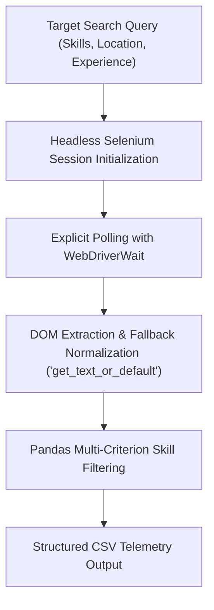
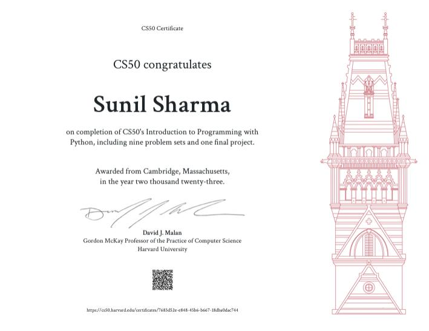

---
date:
  created: 2024-03-10
  updated: 2025-04-05
tags:
  - Python
  - Web Scraping
  - Selenium
  - Automation
  - Data Analysis
description: >
  Automated job market telemetry and data extraction pipeline using Selenium WebDriver, BeautifulSoup, and Pandas with comprehensive pytest test coverage.
---

# Naukri Market Data Scraper

  

    

      Web Automation • Data Extraction
      <h2 class="project-header-title">Naukri Market Telemetry Scraper</h2>
    

    

      <a href="https://github.com/mrxsierra/naukari-webscraper" target="_blank" rel="noopener" class="btn btn-primary">
        <i class="fab fa-github"></i> Repository
      </a>
      <a href="https://www.youtube.com/watch?v=ls_uxjfADN4" target="_blank" rel="noopener" class="btn btn-secondary">
        <i class="fab fa-youtube"></i> Video Demo
      </a>
    

  

  

    

      Role
      Sole Tooling Architect
    

    

      Core Engine
      Selenium WebDriver, Chrome Headless
    

    

      Data Pipeline
      Pandas Vectorized Filtering &amp; CSV Export
    

    

      Accreditation
      Harvard CS50P Python Programming
    

  

  

    <i class="fas fa-spider"></i>
    <strong>Resilient Automation:</strong> Extracts paginated job market telemetry (titles, salary bands, required skills, locations) with graceful fallback handling and pytest test benches.
  

## Architecture &amp; Scraping Flow

## Executive Overview

**Naukri Market Data Scraper** is a Python automation tool that extracts job listings from Naukri.com to facilitate programmatic tech hiring telemetry, salary benchmarking, and skill requirement analysis.

The scraper automates browser navigation across paginated listings, resolves asynchronously hydrated DOM components, normalizes inconsistent compensation notations, and filters results against user-defined skill matrices before exporting clean datasets for downstream analytics.

## Technical Challenges &amp; Architectural Solutions

### 1. Dynamic Client-Side Content Hydration
- **Challenge:** Target pages use asynchronous client-side JavaScript, causing standard static HTTP scrapers to fail due to DOM race conditions.
- **Solution:** Implemented explicit polling utilizing Selenium's `WebDriverWait` and expected conditions, ensuring DOM elements are fully hydrated prior to traversal.

### 2. Inconsistent DOM Schema Normalization
- **Challenge:** Varied markup across sponsored, promoted, and standard job card templates frequently resulted in `NoSuchElementException` crashes.
- **Solution:** Built fault-tolerant fallback parser helpers (`get_text_or_default`) that normalize missing fields to default values without halting the extraction pipeline.

### 3. Automated Regression Testing
- **Challenge:** Ensuring scraper parser logic remains resilient against minor frontend updates.
- **Solution:** Authored a complete test suite in `test_project.py` using `pytest`, featuring mocked DOM responses and fixture-driven parser validation.

## Verified Accreditation

  
  

    Harvard CS50P: Introduction to Programming with Python • Harvard University (CS50)
  

## Video Demonstration

  

<!-- Sequential Case Study Navigation -->

  <a href="../paraxcel/" class="project-nav-card">
    <i class="fas fa-arrow-left"></i> Previous Project
    Paraxcel Document Toolkit
  </a>
  <a href="../test-site/" class="project-nav-card nav-right">
    Next Project <i class="fas fa-arrow-right"></i>
    Real-Time Test Management Interface
  </a>

