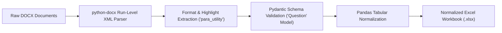

---
date:
  created: 2025-02-15
  updated: 2025-03-15
tags:
  - Python
  - Automation
  - Data Extraction
  - Desktop GUI
description: >
  High-performance DOCX-to-Excel document extraction suite featuring run-level formatting parser, Pydantic validation, and Tkinter desktop GUI.
---

# Paraxcel Document Toolkit

  

    

      Data Automation • Desktop Application
      <h2 style="margin: 6px 0 0 0; font-size: 22px; font-weight: 700;">Paraxcel Document Parsing Engine</h2>
    

    

      <a href="https://github.com/mrxsierra/paraxcel" target="_blank" rel="noopener" class="btn btn-primary">
        <i class="fab fa-github"></i> Repository
      </a>
      <a href="https://www.youtube.com/watch?v=btjMeafD0vU" target="_blank" rel="noopener" class="btn btn-secondary">
        <i class="fab fa-youtube"></i> Video Demo
      </a>
    

  

  

    

      Role
      Sole Architecture &amp; App Developer
    

    

      Application Type
      Local-First Desktop GUI (Windows Executable)
    

    

      Core Technologies
      Python, python-docx, Pydantic, Pandas, Tkinter
    

    

      Accreditation
      Harvard CS50x Computer Science
    

  

  

    <i class="fas fa-file-excel"></i>
    <strong>Automated ETL Pipeline:</strong> Eliminates manual data entry by automatically extracting MCQs, highlighted correct options, and superscripts from DOCX files into validated Excel sheets.
  

## Architecture &amp; Extraction Flow

## Executive Overview

**Paraxcel** is a modular Python desktop utility built to automate the extraction of multiple-choice questions (MCQs), answers, and option formatting from Microsoft Word (`.docx`) documents into structured Excel workbooks (`.xlsx`).

Designed for educators and assessment coordinators, Paraxcel operates entirely offline with zero cloud dependencies. It parses low-level OpenXML document structures to reliably detect marked answers (font color, background highlights) and mathematical notations (superscripts, subscripts).

## Technical Challenges &amp; Architectural Solutions

### 1. Granular XML Run-Level Parsing
- **Challenge:** Detecting highlighted or color-coded answers embedded within arbitrary paragraph runs across inconsistent Word formatting styles.
- **Solution:** Engineered recursive run inspection routines in `para_utility.py` that query OpenXML font color, background tint, and strike-through attributes directly at the character run level.

### 2. Strict Schema Validation &amp; Quality Enforcement
- **Challenge:** Preventing corrupted or partially formatted Word documents from outputting malformed Excel rows.
- **Solution:** Implemented declarative `Pydantic` schemas enforcing strict type bounds (question non-empty, exactly 4 validated options, valid answer index).

### 3. Dependency-Free Desktop Packaging
- **Challenge:** Distributing a Python application to non-technical end-users without requiring a Python runtime environment.
- **Solution:** Configured `PyInstaller` build pipelines with embedded icon resources (`paraxcel.ico`), packaging the application into a standalone Windows binary.

## Verified Accreditation

  
  

    Harvard CS50x: Introduction to Computer Science • Harvard University (CS50)
  

## Application Screenshots

  

    <h4 style="margin: 0 0 8px 0; font-size: 13px;">1. Desktop GUI Interface</h4>
    
  

  

    <h4 style="margin: 0 0 8px 0; font-size: 13px;">2. Sample DOCX Input</h4>
    
  

  

    <h4 style="margin: 0 0 8px 0; font-size: 13px;">3. Normalized Excel Output</h4>
    
  

<!-- Sequential Case Study Navigation -->

  <a href="../s3-faker/" class="project-nav-card">
    <i class="fas fa-arrow-left"></i> Previous Project
    S3 Faker Mock Data Generator
  </a>
  <a href="../naukri-webscraper/" class="project-nav-card" style="text-align: right;">
    Next Project <i class="fas fa-arrow-right"></i>
    Naukri Market Data Scraper
  </a>

