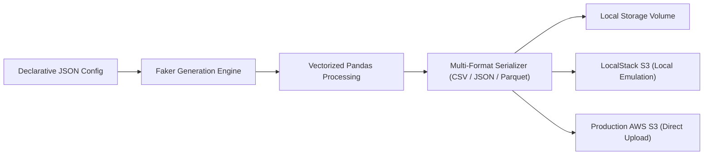

---
date:
  created: 2025-02-10
  updated: 2025-03-15
tags:
  - Python
  - Automation
  - Cloud Infrastructure
  - AWS S3
  - Docker
description: >
  High-throughput synthetic dataset generator with native AWS S3 and LocalStack emulator support for zero-cost cloud testing pipelines.
---

# S3 Faker Mock Data Generator

<div class="project-header-card">
  <div style="display: flex; justify-content: space-between; align-items: flex-start; flex-wrap: wrap; gap: 12px;">
    <div>
      <span class="project-category-badge">Cloud Tooling • Data Automation</span>
      <h2 style="margin: 6px 0 0 0; font-size: 22px; font-weight: 700;">Synthetic Cloud Data Generation Suite</h2>
    </div>
    <div style="display: flex; gap: 8px; flex-wrap: wrap;">
      <a href="https://github.com/mrxsierra/s3_faker" target="_blank" rel="noopener" class="btn btn-primary">
        <i class="fab fa-github"></i> Repository
      </a>
    </div>
  </div>

  <div class="project-meta-grid">
    <div class="project-meta-item">
      <span class="project-meta-label">Role</span>
      <span class="project-meta-val">Lead Tooling Developer</span>
    </div>
    <div class="project-meta-item">
      <span class="project-meta-label">Storage Backends</span>
      <span class="project-meta-val">Amazon S3, LocalStack Emulator, Local FS</span>
    </div>
    <div class="project-meta-item">
      <span class="project-meta-label">Export Formats</span>
      <span class="project-meta-val">CSV, JSON, Apache Parquet</span>
    </div>
    <div class="project-meta-item">
      <span class="project-meta-label">Core Technologies</span>
      <span class="project-meta-val">Python, Faker, Boto3, s3fs, Docker</span>
    </div>
  </div>

  <div class="project-impact-box">
    <i class="fas fa-cloud-arrow-up"></i>
    <span><strong>Zero-Cost Cloud Emulation:</strong> Simulates full AWS S3 object storage workflows locally via containerized LocalStack, eliminating cloud testing infrastructure expenses.</span>
  </div>
</div>

---

## Architecture &amp; Data Pipeline



---

## Executive Overview

**S3 Faker** is a developer-first data synthesis tool designed to generate high-volume, realistic datasets driven by declarative JSON configuration schemas. The generated artifacts can be written to the local filesystem or streamed directly to an Amazon S3 bucket or local containerized LocalStack emulator.

The system addresses a critical bottleneck in modern data engineering: acquiring compliant, realistic test data for ETL pipeline benchmarking without incurring cloud storage costs or risking PII data leaks.

---

## Technical Challenges &amp; Architectural Solutions

### 1. Accurate Cloud Storage Emulation
- **Challenge:** Simulating production S3 bucket policies, multipart uploads, and credential chains locally without AWS cloud spend.
- **Solution:** Integrated `fsspec`, `s3fs`, and LocalStack containerization to ensure transparent parity between local test harnesses and live production endpoints.

### 2. High-Throughput Memory-Efficient Synthesis
- **Challenge:** Generating millions of synthetic records risked Out-Of-Memory (OOM) errors during string serialization.
- **Solution:** Designed a streaming chunk-based generator that streams records directly through compression filters to Parquet and CSV buffers with constant memory consumption.

### 3. Declarative Schema-Driven Customization
- **Challenge:** Allowing engineers to define complex relational schemas without modifying the underlying Python engine.
- **Solution:** Built a dynamic JSON schema interpreter supporting custom distributions, localized locales, foreign key dependencies, and field type coercions.

---

## CLI Workflow &amp; Example Usage

```bash
# Generate synthetic dataset locally
python -m s3_faker --config schema.json --records 50000 --format parquet

# Stream directly to LocalStack S3 emulator
python -m s3_faker --config schema.json --target s3://test-bucket/data/ --endpoint http://localhost:4566
```

---

## Verification &amp; Workflow Visuals

<div class="card-grid-2" style="margin: 20px 0;">
  <div>
    <h4 style="margin: 0 0 8px 0;">LocalStack Emulation Environment</h4>
    <a href="https://raw.githubusercontent.com/mrxsierra/s3_faker/main/img/localstack%20resource.jpg" class="glightbox" data-gallery="s3faker" data-title="LocalStack Resource Visualization">
      
    </a>
  </div>
  <div>
    <h4 style="margin: 0 0 8px 0;">Data Synthesis &amp; Upload Execution</h4>
    <a href="https://raw.githubusercontent.com/mrxsierra/s3_faker/main/img/update.jpg" class="glightbox" data-gallery="s3faker" data-title="Synthetic Data Pipeline Run">
      
    </a>
  </div>
</div>

---

<!-- Sequential Case Study Navigation -->
<div class="project-nav-footer">
  <a href="../ems-db/" class="project-nav-card">
    <span class="project-nav-dir"><i class="fas fa-arrow-left"></i> Previous Project</span>
    <span class="project-nav-title">Examination Management System DB</span>
  </a>
  <a href="../paraxcel/" class="project-nav-card" style="text-align: right;">
    <span class="project-nav-dir" style="justify-content: flex-end;">Next Project <i class="fas fa-arrow-right"></i></span>
    <span class="project-nav-title">Paraxcel Document Toolkit</span>
  </a>
</div>
