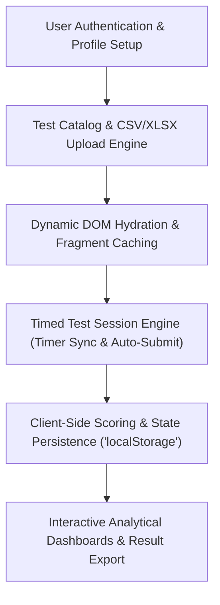

---
date:
  created: 2024-06-15
  updated: 2025-03-20
tags:
  - Frontend
  - JavaScript
  - Bootstrap
  - Web Application
description: >
  Dynamic client-side test management and examination taking interface featuring local storage session persistence, timer synchronization, and responsive UI.
---

# Real-Time Test Management Interface

  

    

      Frontend Engineering • Web Application
      <h2 style="margin: 6px 0 0 0; font-size: 22px; font-weight: 700;">Client-Side Examination Platform</h2>
    

    

      <a href="https://mrxsierra.github.io/test-site/" target="_blank" rel="noopener" class="btn btn-primary">
        <i class="fas fa-arrow-up-right-from-square"></i> Live Application
      </a>
      <a href="https://github.com/mrxsierra/test-site/" target="_blank" rel="noopener" class="btn btn-secondary">
        <i class="fab fa-github"></i> Repository
      </a>
    

  

  

    

      Role
      Sole Frontend Architect &amp; Developer
    

    

      Architecture
      Modular Vanilla JavaScript (ES6 Modules)
    

    

      Data Persistence
      Local-First Schema Serialization (localStorage)
    

    

      Libraries
      Bootstrap 5, PapaParse, XLSX.js, Plotly
    

  

  

    <i class="fas fa-clipboard-check"></i>
    <strong>Zero-Backend Prototyping:</strong> Demonstrates complete test creation, timed execution, real-time scoring, and historical result visualization purely client-side.
  

---

## Architecture &amp; State Lifecycle

---

## Executive Overview

The **Real-Time Test Management Interface** is a client-side web application built with vanilla JavaScript (ES6+), HTML5, and Bootstrap. It demonstrates full test administration workflows without requiring server-side infrastructure:

- Dynamic creation, updating, and deletion (CRUD) of multi-question exams.
- Timed examination sessions with auto-submission triggers.
- In-browser file parsing for bulk question import via CSV and Excel workbooks.
- Historical score tracking and visual performance analytics.

---

## Technical Challenges &amp; Architectural Solutions

### 1. Dynamic View Hydration Without Full Page Reloads
- **Challenge:** Creating a seamless Single-Page Application (SPA) experience without heavy frontend frameworks.
- **Solution:** Implemented a lightweight client-side router leveraging the Fetch API, modular template fragments, and targeted DOM reconciliation.

### 2. Reliable Client-Side State Persistence
- **Challenge:** Preventing data loss when students refresh the browser mid-examination.
- **Solution:** Engineered a robust serialization wrapper around `localStorage` and `sessionStorage` with schema versioning and auto-save timer checkpoints.

### 3. Responsive Multi-Device UI
- **Challenge:** Ensuring consistent test-taking controls across desktop monitors and mobile devices.
- **Solution:** Utilized fluid CSS Grid, modern Flexbox components, and Bootstrap 5 responsive utility classes.

---

## Application Interface Gallery

  

    <h4 style="margin: 0 0 8px 0; font-size: 13px;">1. Test Taking View</h4>
    
  

  

    <h4 style="margin: 0 0 8px 0; font-size: 13px;">2. Analytics Dashboard</h4>
    
  

  

    <h4 style="margin: 0 0 8px 0; font-size: 13px;">3. Score Results View</h4>
    
  

---

<!-- Sequential Case Study Navigation -->

  <a href="../naukri-webscraper/" class="project-nav-card">
    <i class="fas fa-arrow-left"></i> Previous Project
    Naukri Market Data Scraper
  </a>
  <a href="../" class="project-nav-card" style="text-align: right;">
    All Projects <i class="fas fa-arrow-right"></i>
    Engineering Portfolio Index
  </a>

