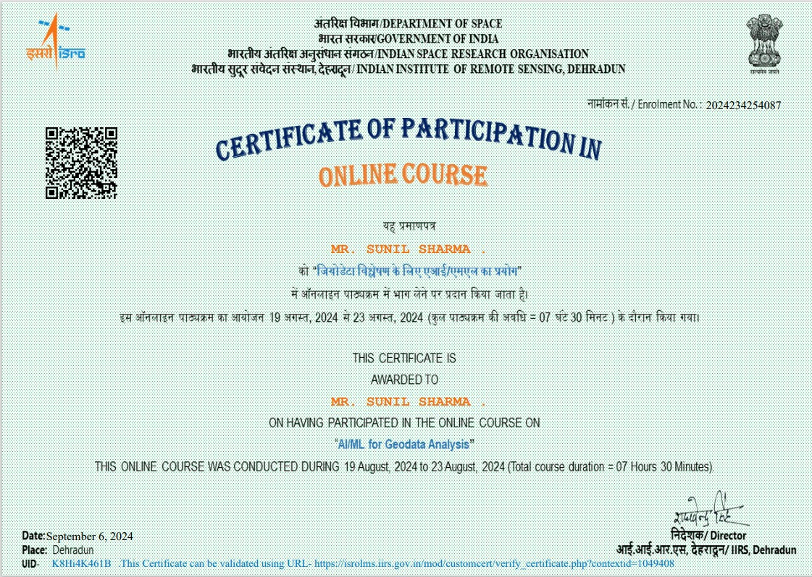

# Credentials &amp; Certifications

  

    

      <h2 class="page-intro-title">Technical Credentials</h2>
      

        Verified accreditations across computer science fundamentals, machine learning systems, relational database architecture, and spatial analytics.
      

    

    

      <a href="../cert/main_resume.pdf" class="btn btn-primary" download>
        <i class="fas fa-file-pdf"></i> Download Resume (PDF)
      </a>
      <a href="https://www.linkedin.com/in/sunilsharma97/details/certifications/" target="_blank" rel="noopener" class="btn btn-secondary">
        <i class="fab fa-linkedin"></i> LinkedIn Accreditations
      </a>
    

  

## Verified Credentials &amp; Accreditations

  <!-- Certificate 1: GSTN Hackathon -->
  

    

      
    

    

      <h3 class="certificate-title">GSTN National Hackathon Finalist</h3>
      
Goods and Services Tax Network (GSTN)

      
Predictive Binary Classification • 2024

    

  

  <!-- Certificate 2: CS50x -->
  

    

      
    

    

      <h3 class="certificate-title">CS50x: Introduction to Computer Science</h3>
      
Harvard University / edX

      
C, Python, SQL, Algorithms &amp; Data Structures

    

  

  <!-- Certificate 3: CS50 SQL -->
  

    

      
    

    

      <h3 class="certificate-title">CS50 SQL: Databases with SQL</h3>
      
Harvard University / edX

      
Relational Schema Design, Normalization, Views &amp; Triggers

    

  

  <!-- Certificate 4: CS50P -->
  

    

      
    

    

      <h3 class="certificate-title">CS50P: Programming with Python</h3>
      
Harvard University / edX

      
Unit Testing, Object-Oriented Design, Regex &amp; Libraries

    

  

  <!-- Certificate 5: IIRS ISRO -->
  

    

      
    

    

      <h3 class="certificate-title">AI/ML for Geodata Analysis</h3>
      
Indian Institute of Remote Sensing (IIRS - ISRO)

      
Machine Learning &amp; Spatial Data Science

    

  

  <a href="../about/" class="btn btn-secondary">
    <i class="fas fa-user"></i> Full Engineering Story
  </a>
  <a href="../projects/" class="btn btn-secondary">
    <i class="fas fa-cubes"></i> View Projects Portfolio
  </a>
  <a href="../contact/" class="btn btn-primary">
    <i class="fas fa-paper-plane"></i> Contact
  </a>

