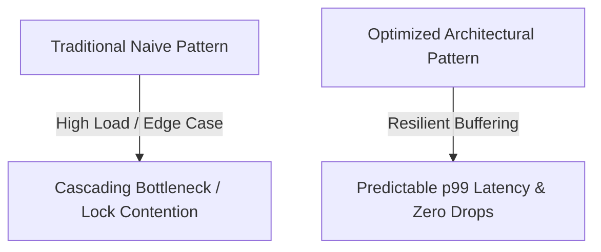

# [Catchy, Specific & Provocative Title]

<!-- Article Sub-Header / Hook -->
<div class="page-intro">
  <p class="page-intro-desc">
    [Start with a strong 1-2 sentence hook. Challenge a common industry belief, share a high-stakes failure you solved in production, or pose a counter-intuitive question.]
  </p>
</div>

<!-- TL;DR Summary Card for Fast Scanners & Social Readers -->
<div class="clean-card">
  <h4>
    <i class="fas fa-bolt"></i> 30-Second TL;DR
  </h4>
  <ul>
    <li><strong>The Problem:</strong> [1-sentence summary of the pain point or misconception.]</li>
    <li><strong>The Discovery:</strong> [The unexpected root cause or insight.]</li>
    <li><strong>The Solution:</strong> [The production pattern / architectural fix with immediate results.]</li>
  </ul>
</div>

## 1. The Real-World Scenario: When the Standard Approach Broke

[Set the scene with a concrete story from a real engineering build. Avoid abstract theory; ground the explanation in tangible constraints like connection spikes, memory bloat, or race conditions.]

- **What we thought would happen**: [Standard textbook approach.]
- **What actually happened in production**: [The breakdown, bottleneck, or unexpected behavior.]
- **The cost of doing nothing**: [Latency spike, cloud cost runaway, or broken user experience.]

## 2. The Mental Model: How to Think About the Problem

Before looking at code, let's understand the underlying mechanics.



> [!IMPORTANT]
> **Key Architectural Takeaway**: [A 1-sentence memorable mental model or law to anchor the reader's understanding.]

## 3. Practical Implementation: "Do This, Not That"

Here is the exact pattern that resolved the bottleneck.

### ❌ The Common Anti-Pattern
```python
# Naive approach that causes silent resource exhaustion under load
def naive_approach(items: list[dict]):
    results = []
    for item in items:
        # Blocking synchronous I/O inside loop
        res = expensive_network_call(item)
        results.append(res)
    return results
```

### ✔ The Production-Grade Solution
```python
# Resilient, batch-oriented, and concurrent pattern
import asyncio


async def resilient_production_approach(items: list[dict], batch_size: int = 50):
    """Processes items in bounded concurrent chunks to prevent connection pool exhaustion."""
    semaphore = asyncio.Semaphore(10)  # Concurrency limit

    async def worker(item):
        async with semaphore:
            return await async_network_call(item)

    return await asyncio.gather(*(worker(item) for item in items))
```

## 4. Production Gotchas &amp; Lessons Learned the Hard Way

Three non-obvious traps to watch out for when implementing this in production:

1. **Trap #1: [e.g. Unbounded Memory Growth]**  
   *Why it happens*: [Explanation.]  
   *How to fix it*: [Mitigation strategy.]

2. **Trap #2: [e.g. Cache Stampede / Thundering Herd]**  
   *Why it happens*: [Explanation.]  
   *How to fix it*: [Mitigation strategy.]

3. **Trap #3: [e.g. Silent Type Coercion Across Dialects]**  
   *Why it happens*: [Explanation.]  
   *How to fix it*: [Mitigation strategy.]

## 5. Summary Cheat Sheet &amp; Shareable Takeaways

<div class="clean-card">
  <h4>📌 Key Takeaways for Engineers &amp; Leaders</h4>
  <ul>
    <li><strong>Rule 1:</strong> [Punchy, tweetable rule of thumb.]</li>
    <li><strong>Rule 2:</strong> [Punchy, tweetable rule of thumb.]</li>
    <li><strong>Rule 3:</strong> [Punchy, tweetable rule of thumb.]</li>
  </ul>
</div>

## 6. Join the Discussion &amp; Share

<div class="clean-card">
  <h3>Found this architectural breakdown helpful?</h3>
  <p>
    Share it with your engineering team or discuss it with me on <a href="https://x.com/mrxsierra" target="_blank" rel="noopener">X (@mrxsierra)</a> or <a href="https://www.linkedin.com/in/sunilsharma97/" target="_blank" rel="noopener">LinkedIn</a>.
  </p>
</div>
