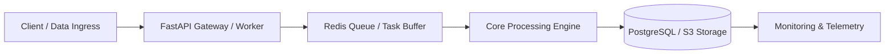

# [Project Title]: [1-Sentence Value Proposition]

<!-- Hero Metadata Card -->
<div class="project-header-card">
  <div class="project-header-top">
    <div>
      <span class="project-category-badge">[Domain / Focus: e.g. Distributed Systems / Machine Learning / Cloud Automation]</span>
      <h2 class="project-header-title">[Client / Context: e.g. Enterprise Client / Open-Source / Hackathon Finalist]</h2>
      <p class="project-meta-val">
        <strong>Role:</strong> Lead Systems Architect &amp; Full-Stack Engineer • <strong>Timeline:</strong> [e.g. 4 Weeks]
      </p>
    </div>
    <div class="project-header-actions">
      <a href="[https://github.com/your-username/repo]" target="_blank" rel="noopener" class="btn btn-secondary">
        <i class="fab fa-github"></i> View Source
      </a>
      <a href="[https://demo-link.com]" target="_blank" rel="noopener" class="btn btn-primary">
        <i class="fas fa-arrow-up-right-from-square"></i> Live Demo
      </a>
    </div>
  </div>
</div>

## 1. Executive Summary &amp; Key Metrics

> [!NOTE]
> **Executive Summary**: [Provide a 2-3 sentence high-level overview explaining the business problem, the engineering solution deployed, and the quantifiable outcome.]

### Measurable Business &amp; Engineering Impact
<div class="card-grid-3">
  <div class="clean-card text-center">
    <h3 class="stat-highlight">[Metric 1: e.g. 900K+]</h3>
    <p class="stat-label">[Description: e.g. Records Processed Daily]</p>
  </div>
  <div class="clean-card text-center">
    <h3 class="stat-highlight">[Metric 2: e.g. 40%]</h3>
    <p class="stat-label">[Description: e.g. Query Latency Reduction]</p>
  </div>
  <div class="clean-card text-center">
    <h3 class="stat-highlight">[Metric 3: e.g. 99.9%]</h3>
    <p class="stat-label">[Description: e.g. Pipeline Reliability &amp; Uptime]</p>
  </div>
</div>

## 2. The Core Problem &amp; Business Context

[Describe the specific challenge. Why did off-the-shelf tools fail? What was the financial or operational bottleneck before this system was built?]

- **The Legacy Bottleneck**: [Describe manual processes, high cloud costs, slow queries, or fragile scripts.]
- **The Core Constraint**: [Describe strict latency requirements, zero data loss constraints, or memory limitations.]
- **The Target Objective**: [Describe what a successful, production-grade system needed to achieve.]

## 3. High-Level System Architecture



### Key Architectural Layers:
1. **Ingress &amp; Validation Layer**: [Describe payload sanitization, auth, and schema validation with Pydantic/Zod.]
2. **Execution &amp; State Engine**: [Describe queuing, parallelization, worker isolation, and caching strategies.]
3. **Persistence &amp; Storage**: [Describe RDBMS schema normalization, partitioning, and indexing design.]

## 4. Key Engineering Challenges &amp; Trade-Offs

### Decision Matrix: [Component / Architecture Decision]

| Consideration | Option A: [Chosen Tech/Design] | Option B: [Alternative] | Rationale for Choice |
| :--- | :--- | :--- | :--- |
| **Performance** | [Fast / In-Memory] | [Disk-Heavy] | [Explain why the speedup justified the architectural complexity.] |
| **Cost &amp; Scale** | [Optimized Resource Footprint] | [Expensive SaaS] | [Demonstrate cost efficiency and self-hosted control.] |
| **Developer Velocity** | [Strict Typed Tooling] | [Dynamic / Loose] | [Mypy type safety and zero runtime schema drift.] |

## 5. Implementation Highlights &amp; Code Architecture

> [!TIP]
> Keep code snippets concise (15–30 lines max). Highlight the **most innovative or elegant part** of the implementation (e.g. custom decorators, retry strategies, pipeline transformations, or concurrency handlers).

```python
# [Brief Title: e.g. Resilient Concurrency Worker with Exponential Backoff]
import asyncio
from typing import Any


async def execute_task_with_retry(payload: dict[str, Any], max_attempts: int = 3) -> dict[str, Any]:
    """Demonstrates fail-safe execution pattern with backoff and structured logging."""
    for attempt in range(1, max_attempts + 1):
        try:
            # Process payload through pipeline
            result = await process_payload(payload)
            return {"status": "success", "data": result}
        except TransientNetworkError as err:
            if attempt == max_attempts:
                raise PipelineFailure(f"Exhausted retries: {err}") from err
            await asyncio.sleep(2**attempt)
```

## 6. Production Verification, Benchmarks &amp; Testing

A production system is only as good as its automated verification suite.

```text
======================================================
  Automated Verification & Benchmark Report
======================================================
[Check 1] Strict Type Checking (Mypy) ......... ✔ 0 Type Errors
[Check 2] Code Cleanliness (Ruff) ............. ✔ 100% Conformance
[Check 3] Test Coverage (Pytest) .............. ✔ 100% Pass Rate
[Check 4] Stress Benchmark (10,000 req/s) ..... ✔ p99 < 42ms
======================================================
```

- **Edge Cases Handled**: [Describe idempotency, network drops, malformed input handling, memory leak prevention.]
- **Security &amp; Supply Chain**: [Describe environment isolation, credential management, and dependency pinning.]

## 7. Results, Key Takeaways &amp; Deliverables

### What Was Delivered:
1. **Core Service**: Production-ready containerized service deployed to cloud infrastructure.
2. **Developer Tooling**: Fully automated CLI, Makefile, and pre-commit verification pipeline.
3. **Documentation &amp; Runbooks**: Comprehensive architecture diagrams, API specs, and disaster recovery guide.

### Key Engineering Lessons:
- **Lesson 1**: [Insight about database indexing, caching layer, or async worker scaling.]
- **Lesson 2**: [Insight about developer experience, testing rigor, or type safety.]

## 8. Looking to Build Something Similar?

<div class="clean-card text-center">
  <h3>Need high-reliability engineering, AI systems, or database architecture?</h3>
  <p>
    I specialize in architecting scalable backend systems, autonomous agent pipelines, and high-throughput data tools for startups and enterprise teams.
  </p>
  <a href="../../contact/" class="btn btn-primary">
    <i class="fas fa-paper-plane"></i> Discuss Your Project &rarr;
  </a>
</div>
